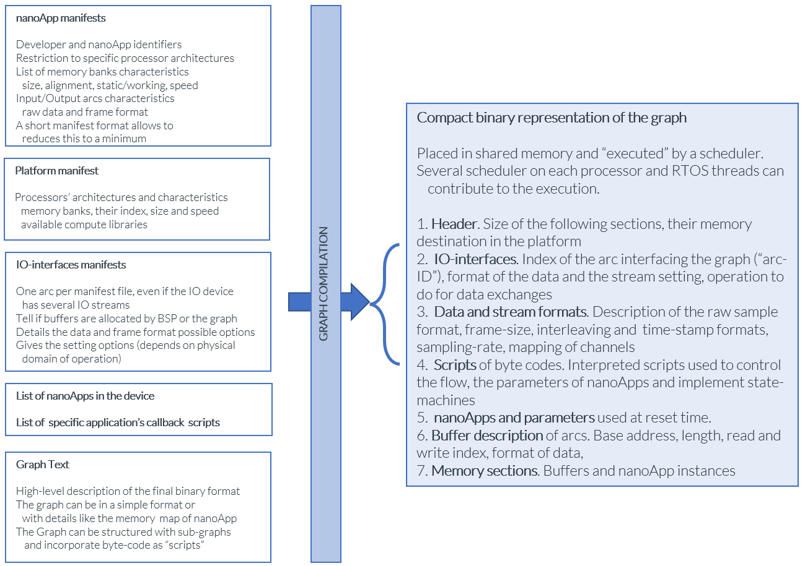

## Table of contents

[*Introduction [4](#introduction)*](#introduction)

[*Graph-description [5](#graph-description)*](#graph-description)

[*nanoApps [5](#nanoapps)*](#nanoapps)

[*Scheduler [5](#scheduler)*](#scheduler)

[*Stream-based processing
[6](#stream-based-processing)*](#stream-based-processing)

[*Graph creation [6](#graph-creation)*](#graph-creation)

[*Create a nanoApps [7](#create-a-nanoapps)*](#create-a-nanoapps)

[*Create an IO-interfaces
[7](#create-an-io-interfaces)*](#create-an-io-interfaces)

[*Create a digital platform Abstraction-Layer
[7](#create-a-digital-platform-abstraction-layer)*](#create-a-digital-platform-abstraction-layer)

[*Scheduler operations and multiprocessing
[7](#scheduler-operations-and-multiprocessing)*](#scheduler-operations-and-multiprocessing)

[*Applications [8](#applications)*](#applications)

[*Last minute tuning. [8](#last-minute-tuning.)*](#last-minute-tuning.)

[*Low-code tuning. [8](#low-code-tuning.)*](#low-code-tuning.)

[*Language agnostic. [8](#language-agnostic.)*](#language-agnostic.)

[*Platform memory abstraction.
[8](#platform-memory-abstraction.)*](#platform-memory-abstraction.)

[*Stream format conversion.
[8](#stream-format-conversion.)*](#stream-format-conversion.)

[*Different physical domains.
[8](#different-physical-domains.)*](#different-physical-domains.)

[*Data flows with drifts.
[8](#data-flows-with-drifts.)*](#data-flows-with-drifts.)

[*Computing acceleration.
[8](#computing-acceleration.)*](#computing-acceleration.)

[*Heterogenous architectures.
[8](#heterogenous-architectures.)*](#heterogenous-architectures.)

[*Multiprocessing. [8](#multiprocessing.)*](#multiprocessing.)

[*Low memory consumption.
[8](#low-memory-consumption.)*](#low-memory-consumption.)

{width="6.268055555555556in"
height="2.5194444444444444in"}

## Introduction 

This document details the implementation of a graph of nodes (computing
elements called "**nanoApps**") connected with directed edges (called
"**arcs**" or "buffers" placed between two nanoApps). The graph
interfaces with the data streams of the platforms at its boundaries,
called "**IO-interfaces**".

CMSIS-Graph is a scheduler and interpreter of a graph of nanoApps,
designed for the use-cases:

-   **Last minute tuning**. A graph of nanoApps needs to be quickly
    updated with new parameters and the insertion of a nanoApp, without
    recompiling the application.

-   **Low-code tuning**. A GPIO is triggered upon a change of level in
    an input stream, or a variable of a nanoApp, without recompiling the
    application.

-   **Language agnostic**. The nanoApps are developed in various
    programming language and delivered in binary, with position
    independent compilation.

-   **Platform memory abstraction**. The nanoApps are delivered to the
    system integrator with memory requirements (static and scratch
    memory, speed and alignment requirements). For example a DTCM
    presence and size will be abstracted through opaque interface.

-   **Stream format conversion**. The nanoApps are delivered with a
    manifest including the interfaces details about the data and stream
    formats. CMSIS-Graph is delivered with converters.

-   **Different physical domains**. The graph is mixing flows from
    different families of sensor (motion, temperature, audio, camera ..)
    and the stream formats are standardized at the IO-interfaces. For
    example a normalized pressure sensor stream can be used to control
    the level of a sinewave generator in the audio domain.

-   **Data flows with drifts**. The graph is able to mix flows with flow
    error management. For example mixing streams of audio sources
    originated from different mixed-signal clock domains.

-   **Computing acceleration**. The scheduler proposes DSP and ML
    computing services to the nanoApps to facilitate performance scaling
    with code portability. For example a nanoApp compiled for Cortex-M4
    using FFT or convolutional networks will scale in performance on MVE
    architectures, without recompilation.

-   **Heterogenous architectures**. The graph is in a shared memory
    accessed by any processor architectures. The graph data structures
    are not using physical addresses.

-   **Multiprocessing**. The graph allows some nodes to be executed from
    a specific processor, a specific architecture, or a specific task of
    an RTOS. For example, some nodes will have low-latency execution
    constraints, others can be executed in low-priority threads.

-   **Low memory consumption**. One targeted objective is to execute
    simple machine-learning operations on extreme low-cost platforms.
    For example a graph which consists of a DSP filter, a signal to
    noise detection and a GPIO triggering events with tunable thresholds
    on a device having 2kBytes of internal RAM and 32kBytes of Flash.

The CMSIS-Graph scheduler takes several input for its processing:

-   The **Graph-Description** ("GD") which the compact representation of
    the interactions between nanoApps.

-   The **Abstraction-Layer** ("AL") interface with the platform
    capabilities (low-level memory access services, IO-interfaces set-up
    and control)

-   A list of custom subroutines provided by the application (called
    "**Application-Callbacks**").

-   The list of pointers to the nanoApps entry points

A summary of the above data is following here, and the details are in
the final section [here](#nanoapps).

## Graph-description

The graph is a table of 32bits words interpreted by a nanoApp scheduler.
There are seven sections in the graph:

1.  **Header.** Size of the following sections, their memory destination
    in the platform

2.  **IO-interfaces.** Index of the arc interfacing the graph
    ("arc-ID"), format of the data and the stream setting, operation to
    do for initiating data exchanges

3.  **data and stream formats**. Description of the raw sample format,
    frame-size, interleaving and time-stamp formats, sampling-rate,
    mapping of channels

4.  **scripts of byte codes**. Interpreted scripts used to control the
    flow, the parameters of nanoApps and implement state-machines

5.  **nanoApps** and parameters used at reset time. Each nanoApp is
    described with an identification code, list of arcs it is connected
    to, index to the memory banks reserved for the execution, the preset
    and parameters to use at initialization time, the processor, RTOS
    thread and architecture it is assigned to

6.  **Buffer description of arcs**. Base address, length, read and write
    index, format of data, operation to execute for debug and during
    flow error

7.  **Memory sections**. Buffers and nanoApp instances

The scheduler receives a pointer to the Graph-description and interprets
it. It returns to the application caller when the data flow is completed
or at nanoApp boundary.
Example of graph
[here](https://github.com/ARM-software/EndpointAI/blob/master/Nodes/Graph_Interpreter/graph_doc/graph_example.txt)

## nanoApps

A nanoApp is a subroutines (single entry point) with four parameters.
The declaration follows this template: *void nanoApp_name (int32_t
command, stream_handle_t instance, stream_xdmbuffer_t \*data, uint32_t
\*status)*

The "command" tells if the call is related to initialization/reset, or
reading/setting parameters, processing a stream of data or stopping the
processing. The "instance" handle is translated to a pointer to the
static area of the nanoApp. The "data" is a structure of pointers and
size of data for input and output processed streams (see details
[below](#create-a-nanoapps)).

## Scheduler

CMSIS-Graph has two entry points, one is called by the application for
the interpretation of the graph (*arm_graph_interpreter (command,
\*instance, \*data, \*status)*), the second is a call-back from
interrupts to notify the transfer of data and update the arcs at the
boundary of the graph (*platform_io_ack (IO, \*data, size)*).

The scheduler entry point has a prototype similar to nanoApps, with a
command telling to reset the graph, processing it and setting
parameters. At reset time the IO-interfaces are set and started. The
scheduler processing consists in scanning the IO-interfaces, initiate
data transfers in case of slave protocol (the call to the
Abstraction-Layer will translate this for example to trigger a software
DMA request or an I2C transfer).

IO-Interfaces operating in master mode will call the call-back entry
point of the scheduler, to notify the readiness of new data, or to tell
the previous buffer was transferred. The call-back updates the read and
write indexes of the arc buffer descriptor.

Once the IO-interfaces are scanned, the scheduler is activating a
nanoApp after checking it is assigned to the current processor RTOS
thread and architecture, has enough data on the input arcs and output
free space on the output arcs.

The scheduler is set to return to the caller after each nanoApp
processing or the processing of the full list of nanoApps or when the
list is looped continuously and interrupted when no more data is
available for processing.

\_\_\_\_\_\_\_\_\_\_\_\_\_\_\_\_\_\_\_\_\_\_\_\_\_\_\_\_\_\_\_\_\_\_\_\_\_\_\_\_\_\_\_\_\_\_\_\_\_\_\_\_\_\_\_\_\_\_\_\_\_\_\_

## Stream-based processing

CMSIS-Graph is delivered with nine subfolders:

-   **stream_al** hold the abstraction layer of the targetted platform.
    "platform_al.c" is the interface used by the scheduler, and
    "platform_XXXX.c" are the files interfacing with the specific
    interfaces. Each platform has its list of "manifests" (text format)
    describing the IO interfaces their data and stream format, the
    set-up options (mixed-signal and digital settings).

-   **stream_build** has the different code build techniques

-   **stream_demo** is the "main" program for a minimal set-up and
    execution of the graph

-   **stream_graph**, the place of the graph in text format, the
    compiled graph in binary format ready for the scheduler
    interpretation, and a binary file format made to patch a segment of
    Flash of the targeted device.

-   **stream_libraries** are external libraries like CMSIS-DSP

-   **stream_nodes** are the source code of the nanoApp

-   **stream_src** is the source code of the graph interpreter

-   **stream_test** are test-patterns for the validation of the nodes
    and graph

-   **stream_tools** is the folder of the "compilation tool" to go from
    the ASCII text description of the graph (in "stream_graph") to the
    binary format used by the scheduler ([here](#graph-description)).

## Graph creation

CMSIS-Graph makes no hypothesis on the method used to generate the graph
binary sequence described [here](#graph-description). A program is
proposed to translate an ASCII text file to the graph format. Design
with GUI tool could be used instead, and a seed generating a Yaml file
is proposed in the "stream_tools" folder.

The text to binary translation consists in reading the "manifests" files
of the processors (it gives the memory map and processors details), of
the IO-interface peripheral (data and stream formats, available options
at set-up time), and of the nanoApps (number of arcs and their
characteristics, memory allocation requirements). Then the text file of
the graph is parsed and the proposed format is close to the final
binary. The memory mapping is made in two pass: looking at the static
memory areas (nanoApps instances and arc buffers), the at the working /
scratch memory section declared at the end of the graph.

## Create a nanoApps

Each nanoApp is seen from the scheduler as a pointer to function of this
prototype : void nanoApp_name (int32_t command, stream_handle_t
instance, stream_xdmbuffer_t \*data, uint32_t \*status). The scheduler
makes no assumption on how the code was generated : it can result of
source-code compilation, linking a library, a list of opcodes resulting
from compilation with independent position in any programming language.

The "command" is a bit-field:

-   4 bits reserved for the action: reset, set / read parameters, run,
    stop

-   4 bits for the number of data streams to process in the "XDM"
    structure

-   4 bits for the "**preset**" : instead of configuring parameters some
    default values are embedded in the code of the nanoApps, and called
    "preset". A "set parameter" command can be a set of patched
    parameters on top the defined preset.

-   8 bits for extra parameters

The "stream_handle" parameter has two meanings:

-   During a reset command it is a pointer to the list of memory
    addresses (of type \*\*intPtr_t, intPtr_t uint32_t or uint64_t
    depending on the processor architecture) requested by the nanoApp
    and described in its manifest. The first address of the list is the
    "instance": the static memory which differentiates this nanoApp for
    other replicas in the graph

-   For the other commands it is pointer to the instance (type
    \*intPtr_t)

The "stream_xdmbuffer" parameter has three meanings:

-   During the reset command it is function pointer to "**services**".
    The scheduler offers DSP, ML, a subset of standard libraries : stdio
    / stdlib / string / time / math, debug trace, and other functions
    reserved for scripts. The calls to services are initiated from a
    single place in the nanoApp to let the scheduler recover the return
    address and make security checks.

-   During "set parameters" commands it is an uint32_t\* pointer to the
    parameters to set. The first word is a header giving the "preset"
    configuration to consider before patching it with the new following
    parameters; the number of uint32_t words to read in the parameter
    set, and "tag" telling "all the nanoApp parameters will be updated"
    (code 0xFF) or "this specific parameter indexed from 0 to 0xFE will
    be updated". The following data is a byte stream of parameters.

-   For the other commands it is a pointer to the list of structures
    with a pointer to the data and the size of the data in Bytes. The
    number of structures corresponds to the number of arc given in the
    command. In usual situations the nanoApp has a fixed number of input
    and output arcs and the command field is not used.

The "status" field is used to tell the scheduler if the processing of
the nanoApp is terminated. If not, the scheduler has the opportunity to
scan the IO-Interfaces (usefull for platforms without RTOS) and it
returns to the nanoApp later for the termination of the processing.

## Create an IO-interfaces

## Create a digital platform Abstraction-Layer

## Scheduler operations and multiprocessing

## Applications

This section details the implementation of the initial use-cases.

.. .. .. TBC .. .. ..

### Last minute tuning. 

A graph of nanoApps needs to be quickly updated with new parameters and
the insertion of a nanoApp, without recompiling the application.

### Low-code tuning.

A GPIO is triggered upon a change of level in an input stream, or a
variable of a nanoApp, without recompiling the application.

### Language agnostic. 

The nanoApps are developed in various programming language and delivered
in binary, with position independent compilation.

### Platform memory abstraction. 

The nanoApps are delivered to the system integrator with memory
requirements (static and scratch memory, speed and alignment
requirements). For example a DTCM presence and size will be abstracted
through opaque interface.

### Stream format conversion.

The nanoApps are delivered with a manifest including the interfaces
details about the data and stream formats. CMSIS-Graph is delivered with
converters.

### Different physical domains. 

The graph is mixing flows from different families of sensor (motion,
temperature, audio, camera ..) and the stream formats are standardized
at the IO-interfaces. For example a normalized pressure sensor stream
can be used to control the level of a sinewave generator in the audio
domain.

### Data flows with drifts. 

The graph is able to mix flows with flow error management. For example
mixing streams of audio sources originated from different mixed-signal
clock domains.

### Computing acceleration. 

The scheduler proposes DSP and ML computing services to the nanoApps to
facilitate performance scaling with code portability. For example a
nanoApp compiled for Cortex-M4 using FFT or convolutional networks will
scale in performance on MVE architectures, without recompilation.

### Heterogenous architectures. 

The graph is in a shared memory accessed by any processor architectures.
The graph data structures are not using physical addresses.

### Multiprocessing. 

The graph allows some nodes to be executed from a specific processor, a
specific architecture, or a specific task of an RTOS. For example, some
nodes will have low-latency execution constraints, others can be
executed in low-priority threads.

### Low memory consumption.

One targeted objective is to execute simple machine-learning operations
on extreme low-cost platforms. For example a graph which consists of a
DSP filter, a signal to noise detection and a GPIO triggering events
with tunable thresholds on a device having 2kBytes of internal RAM and
32kBytes of Flash.
