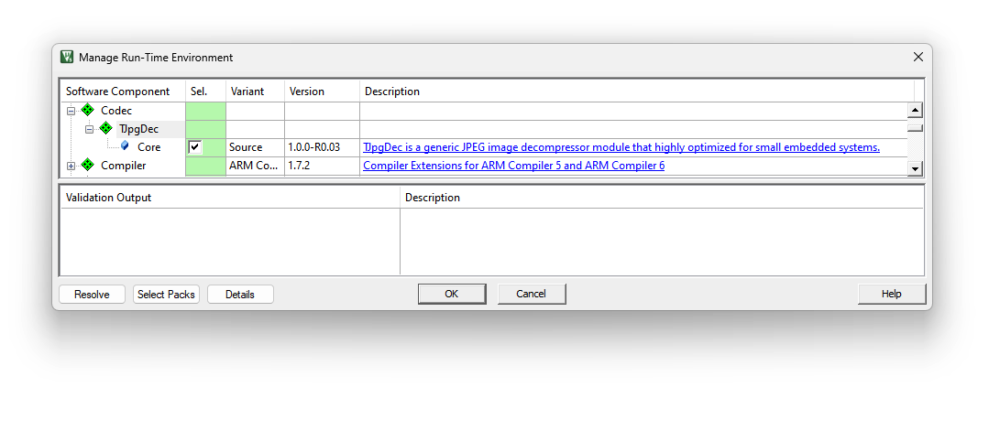
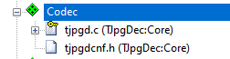
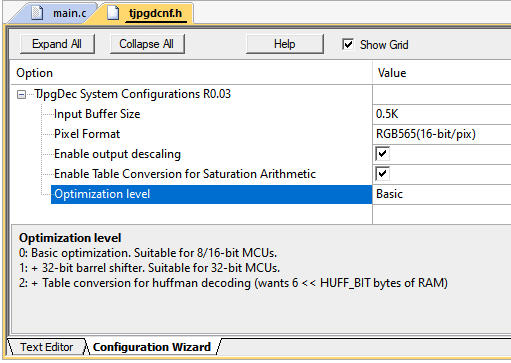

# TJpgDec - Tiny JPEG Decompressor 

## 1. Overview

### 1.1 About this repository

This is a fork of the TJpgDec from http://elm-chan.org/fsw/tjpgd/00index.html. The vesion is [R0.03](http://elm-chan.org/fsw/tjpgd/arc/tjpgd3.zip)

### 1.2 The Original Readme

TJpgDec is a generic JPEG image decompressor module that highly optimized for small embedded systems. It works with very low memory consumption, so that it can be incorporated into tiny microcontrollers, such as AVR, 8051, PIC, Z80, Cortex-M0 and etc.

#### Features

- Platform Independent. Written in Plain C (C99).
- Easy to Use Master Mode Operation.
- Fully Re-entrant Architecture.
- Configurable Optimization Level for both 8/16-bit and 32-bit MCUs.
- Very Small Memory Footprint:
  - 3.5K Bytes of RAM for Work Area Independent of Image Dimensions.
  - 3.5-8.5K Bytes of ROM for Text and Constants.
- Output Format:
  - Pixel Format: RGB888, RGB565 or Grayscale Pre-configurable.
  - Scaling Ratio: 1/1, 1/2, 1/4 or 1/8 Selectable on Decompression.

### Application Interface

There are two API functions to analyze and decompress the JPEG image.

- [jd_prepare](http://elm-chan.org/fsw/tjpgd/en/prepare.html) - Prepare decompression of the JPEG image
- [jd_decomp](http://elm-chan.org/fsw/tjpgd/en/decomp.html) - Execute decompression of the JPEG image

### I/O functions

To input the JPEG data and output the decompressed image, TJpgDec requires two user defined I/O functions. These are called back from the TJpgDec module in the decompression process.

- [Input Funciotn](http://elm-chan.org/fsw/tjpgd/en/input.html) - Read JPEG data from the input stream
- [Output Function](http://elm-chan.org/fsw/tjpgd/en/output.html) - Output the decompressed image to the destination object

## 2. Deploy using CMSIS-Pack

### 2.1 In MDK

Find and install the cmsis-pack, i.e. `ELM.TJpgDec.x.x.x.pack`. 

**NOTE**: Here `x.x.x` is the version of the cmsis-pack but not the actual version of **TJpgDec**.

In the MDK project that you want to deploy the **TJpgDec**, open **RTE** dialog as shown below:

 

Expand the `Codec`, `TJpgDec` and select the `Core`. Click OK to close this dialog. In the Project manager, you will see two files have been added:

 

Now the **TJpgDec** is added to the project. 

**NOTE**: 

1. Please make sure you have at least enabled the `c99` standard to compile it correctly. 
2. By clicking the **description in blue**, you can open the official application note which explains how to use this library.

In order to configure the **TJpgDec**, you can open the `tjpgdcnf.h` and switch to the **Configuration Wizard** as shown below:

  

Enjoy~

### 2.2 Using CMSIS-Tools

## 3. CMSIS-Stream Interface
