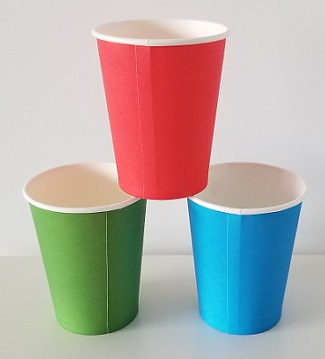
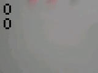

# On-device machine learning project for cups recognition

Smart Vision Project based on the [OpenMV H7 board](https://openmv.io/products/openmv-cam-h7).

The workflow of deploying a machine learning model on the device consists of three steps:
1. Create and add dataset to project
2. Train the neural network with your dataset
3. Deploy your network and try it

The following steps walk you through how to cleverly deploy an object detection algorithm for cups which can also keep track of how many there are in the image. To do this, we'll use a few image processing tricks that will allow us to only scan the relevant parts of the image rather than the whole image; thus reducing processing power requirements and increasing the speed of the algorithm.

<p float="center">
    
</p>

## Required Hardware

* [OpenMV H7 board](https://openmv.io/products/openmv-cam-h7)
* microSD card
* micro USB cable

## Prerequisites

First step is to clone the git repository in your working tree :
```
git clone https://github.com/ARM-software/EndpointAI.git
cd EndpointAI/ProofOfConcepts/Vision/OpenMvCupDetect
```

Second step is to install TensorFlow environment:
You need to have Python 3 installed, check python version with :
```
python3 -V
```

Now install venv module
```
sudo apt install python3-venv
```

Create a virtual environment in your working tree
```
mkdir my_tensorflow
cd my_tensorflow
python3 -m venv venv
source venv/bin/activate
pip install --upgrade pip
pip install --upgrade tensorflow
```

## Cups recognizer

This project is a POC on how to detect red and green cups on a shelf.
It currently has 2 parts:
* `omv_python`: the python scripts to be run on the OpenMV Camera.
* `neural_networks/tflite`: the scripts used to create and train the tensorflow lite neural network used to detect the cups.

### Creating the neural network training dataset

Several scripts have been created to create the training dataset which should have as many examples as possible:
* `cups_batch.py` on the camera side and `create_dataset_batch.py` on the post-treatment side alow to create training image by batch: a picture of several known cups aligned is taken and then divided in the correct number of cups images with the correct label.

Use `cups_batch.py` python script on OpenMV IDE to catch cups images. You need to edit the variables in the top of the file with your cups size (height, width, ...).
When the script is executed, the images will be saved on the camera's microSD card. Then simply copy them into the following project directory : **neural_networks/tflite/cups_batch**

You can now create the dataset from the recorded images. You just have to call the script `create_dataset_batch.py` by passing the images recorded before in parameters. Before calling the script, you must edit it to adapt it to the size of your images (width, length, ...).
For example : 
```
python create_dataset_batch.py --image_blob ./cups_batch/YOUR_IMAGE.bmp
```

* `cups_feedback.py` on the camera side and create_feedback_dataset.py on the post-treatment side alow to run the neural_network and manually correct its mistake by adding the cups pics with the manually corrected label to the dataset.

### Creating and training the tflite neural network

`create_and_train_model.py` based on tensorflow creates and trains the neural network using the dataset that should have been already created.
The resulting tflite model should then be copied on the camera's microSD card.

Command to create neural network tflite file (You need to source your TensoFlow virtual environment before launching the command):
```
source MY_TENSORFLOW_FOLDER/venv/bin/activate
python ./create_and_train_model.py
```

### Running the cups detection

You need to copy the tflite file to the OpenMv camera's microSD card and run the detection scripts using OpenMV IDE.
Don't forget to adjust the variables present at the beginning of the file in order to adapt the script to the size of the objects to be detected.

`cups_detection.py` is used to detect cups on the OpenMV Camera

The script starts by using the ratio for the size of the cups that you have provided, 

```python
cup_width = 13
cup_height = 19
```
Then we step through rectangular sub-pictures for each frame until we find a "blob" of color (red or green) which is what we run through the neural net. This allows us to pack specific knoledge (the real world size of the cup) in a way that let's us run the object detection with a lot less data and processing, thus we get a faster algorithm. 

Loading the model:

```python
# tflite loading part
modelname = "model_cup_quantized_256.tflite"
mytfmodel = tf.load(modelname, True)
```

We can also provide more information to our script so the algorithm has more specific information about the [color](https://www.xrite.com/blog/lab-color-space) of the cups that we are using:

```python
thresholds_cups = [ (20, 100, 30, 128, 0, 128), (20, 80, -100, -20, 10, 80), ] # generic red and green thresholds
```

After stepping through the frame we have a list of blobs which we run through the neural net:

```python
 for obj in mytfmodel.classify(img, (woff, hoff, cup_width, cup_height), min_scale=1.0, scale_mul=0.5,
                                            x_overlap=0.0, y_overlap=0.0):
                    tf_result = obj.output()
                    max_result_value = max(tf_result)
                    most_likely_idx = tf_result.index(max_result_value) # if 1 then red cup 
```

Finally, we have to deal with the problem of overlapping sub-pictures in which they both detect a blob which is actually the same cup. For this, we run an overlap detection algorithm which then triggers an averaging from the number of cups we got to try to compensate for the overlap, this results in our final count for the number of cups.


