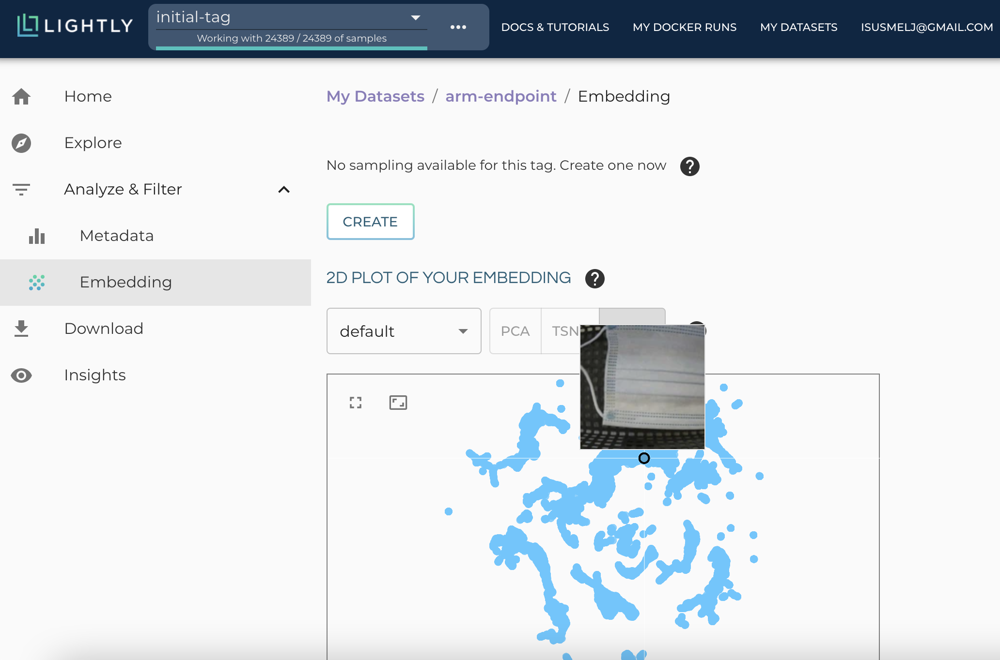
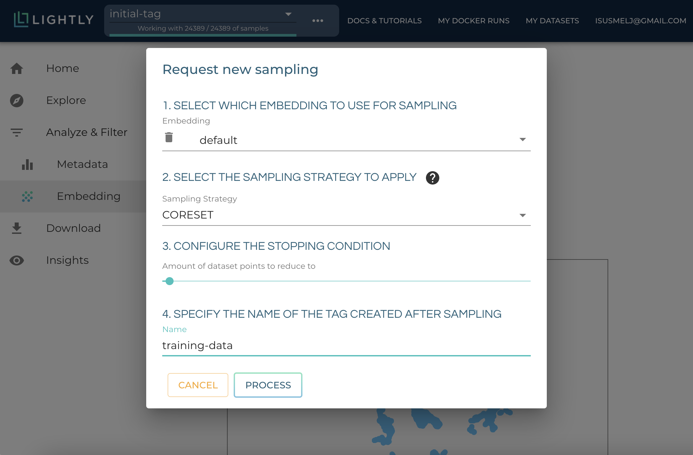
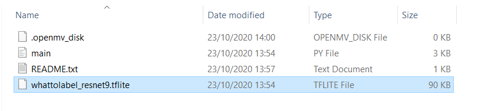

ls d# On-Device Deep Learning with Lightly

> In this tutorial, you learn how to train an image classification model for visual inspection with only 500 labeled images and how to deploy it on the OpenMV H7 board. 

The [OpenMV H7 board](https://openmv.io/products/openmv-cam-h7) with the Cortex-M7 Microcontroller makes on-device machine learning accessible to a broad audience. It allows us to do quick, on-device inference on images with deep neural networks and hence can be a powerful tool for visual inspection, object detection, and more. The workflow of deploying a machine learning model on the device consists of three steps:
1. Select the training data and annotate the images.
2. Train the deep neural network on the annotated images.
3. Deploy the network on the device.

[Lightly](https://lightly.ai) integrates perfectly in this workflow as it helps to make an intelligent choice of images to annotate in the process of training the machine learning model. We use Lightly to only annotate the most relevant 500 images out of the 25'000 available ones.
The following tutorial guides through the process of training and deploying a model to distinguish between intact and defect face masks in a production line setting.

**Disclaimer:** The data and model used in this tutorial serve demonstrative purposes only!


## Prerequisites

What you need to start:
- **Device:** This tutorial uses the OpenMV H7 board with the Cortex-M7 Microcontroller.
- **Raw image data**: The data in this tutorial was recorded using the OpenMV H7 integrated camera and the OpenMV IDE.

>This tutorial has been tested using the OpenMV IDE 2.5.0 and OpenMV firmware 3.6.4 (ships by default with the IDE version 2.5.0)

```
git clone https://github.com/ARM-software/EndpointAI.git
cd EndpointAI/ProofOfConcepts/Vision/OpenMvMaskDefaults/
```

To get started, create a new conda environment and install the `lightly` pip package with the following commands:
```shell
conda env create -f environment.yml
conda activate lightly-cortex-m7
pip install lightly
```

You can also use your environment. Please note that we tested the implementation using the following packages:

- Python 3.6
- Tensorflow 1.15.0
- Torch 1.7.1
- Torchvision 0.8.2
- Lightly 1.0.8

## Data Collection and Annotation
Annotating thousands of images by hand can be exhausting and even if the annotation process is outsourced, it would be more cost-efficient to work on fewer, intelligently selected images. This section shows how the [Lightly web-app](https://app.lightly.ai) can be used to sample a high-quality subset of images as training and test data.

### Dataset Format
We assume you have a folder with images. Rename this folder `raw` since we assume there are no annotations available and add it to the `data` folder. In the next steps of this tutorial we will extract a subset of images for a `train` and a `test` set.

Finally, our folder structure will look like this (with `train` and `test` created later during this tutorial). Example images of all three classes can be seen below.
```shell
data/
+--- train/
     +--- bad/
     +--- good/
     +--- no_mask/
+--- test/
     +--- bad/
     +--- good/
     +--- no_mask/
+--- raw/
```

<p float="center">
  
   
  
</p>

> If you already have a dataset following this structure you can directly jump to section **Train a Model to Detect Defect Masks**


### [Optional] Pretrain a self-supervised Feature Extractor

> Note that to pretrain your own self-supervised model a computer with a GPU is recommended! You can skip this section and use our pretrained model stored at `checkpoints/pretrained.ckpt` and computed embeddings stored at `data/embeddings.csv`.

In a first step, a self-supervised, deep neural network is trained on the raw image data and embeddings are generated for each image based on unique features. These embeddings will accelerate the finetuning on the labeled set of images later. Make sure you have the raw image data at `data/raw`. Then, in the command line type:
```shell
lightly-magic input_dir=data/raw model.name=resnet-9 model.width=0.125 model.num_ftrs=16 \
     collate.input_size=64 collate.cj_prob=0.5 collate.min_scale=0.5 loader.batch_size=768 \
     trainer.max_epochs=100 hydra.run.dir=./outputs
```
**In case you have no GPU available, it's recommended to reduce the number of epochs**, e.g. `trainer.max_epochs=5`. 

Furthermore, **if the batch size is too large to fit in memory**, try lowering it until it does, e.g. `loader.batch_size=256`

Copy the embeddings and model checkpoint from the output directory to your working directory. Both will be reused in later step. Make sure to replace the `PLACEHOLDER` to match your files.
```shell
mv outputs/lightly_epoch_PLACEHOLDER.ckpt checkpoints/pretrained.ckpt
mv outputs/embeddings.csv data/
```

### Sample a Subset of Images for Annotation

The second step is to upload the images to the [Lightly web-app](https://app.lightly.ai). For this, simply login on the web-app and then head to "My Datasets". Upon creating the new dataset with a name such as `masks-dataset`, the command to upload images will be displayed. The command contains the dataset id and your personalized access token. We can use a slightly different version of the command to include the embeddings in our upload as well.
**Hint:** In case of privacy concerns, it is possible to upload **only metadata** of the images - the images will not leave your computer. The upload of the images and embeddings may take a few minutes.

```shell
lightly-upload dataset_id='MY_DATASET_ID' token='MY_TOKEN' input_dir=data/raw embeddings=data/embeddings.csv upload='metadata'
```

After uploading the images and embeddings, the dataset can be filtered. Head to "Analyze & Filter" -> "Embedding". Sampling a such a large dataset of 25'000 images can take a few minutes. The page will automatically refresh once the sampling is complete.



For the **training data** choose the coreset filter method as it will sample a diverse set of images. Once you are on the embedding page click on the *create* button to create a new sampling. Pick `CORESET` for the sampling strategy. Move the slider to 200 samples and give the output tag the name `training-data`.



For the **test data** choose random sampling. This will give you a representative subset of the raw data. Put the slider to 500 images and save your selection by creating a new tag named `test-data`.

Download the images from the command line. This will copy the selected images from the source folder to a new directory specified by "output_dir".
```shell
lightly-download tag_name='training-data' dataset_id='MY_DATASET_ID' token='MY_TOKEN' input_dir='data/raw' output_dir='data/train'
```

```shell
lightly-download tag_name='test-data' dataset_id='MY_DATASET_ID' token='MY_TOKEN' input_dir='data/raw' output_dir='data/test'
```

Now comes the pesky part: Annotate the images by distributing them into subdirectories depending on their labels. Do this by hand or use annotation tools at your disposal. A simple way to annotate the data is to look at each image one-by-one and to move the image to the directory where it belongs. In this tutorial, an image contains a mask if at least 50% of the image is covered by it. The resulting directory tree should look like this:

```shell
data/
+--- train/
     +--- bad/
     +--- good/
     +--- no_mask/
+--- test/
     +--- bad/
     +--- good/
     +--- no_mask/
+--- raw/
+--- embeddings.csv
```

## Train a Model to Detect Defect Masks
The model which was used to generate the embeddings can now be finetuned to the specific task at hand.

### Finetune the Feature Extractor to the Task
You can change the number of epochs, the number of classes, and a lot more. For more information see:
```shell
python finetune.py --help
```
To finetune with the default settings use the following command:
```shell
python finetune.py --pretrained checkpoints/pretrained.ckpt --data data/train --test_data data/test
```

## Deploy the Model on your Device
Before the model can be deployed on the device it must be converted to a quantized Tensorflow-Lite model. This conversion is done in two steps: First, the model is transformed from PyTorch to Keras and then from Keras to Tensorflow-Lite.

### Convert PyTorch Model to Keras
Use the provided script to convert the model from PyTorch to Keras:
```shell
python pytorch_to_keras.py --finetuned checkpoints/finetuned.pt
```

### Quantization and Tensorflow-Lite
Use the provided script to quantize the model and convert it from Keras to Tensorflow-Lite. Run the "evaluate.py" to check post-quantization accuracy on the test data. 
```shell
python keras_to_tflite.py --keras_model checkpoints/keras_model.h5
python evaluate.py --tflite_model checkpoints/lightly_resnet9.tflite
```

If the accuracy after quantization drops significantly, try out different default ranges with the following arguments (default is (-25, 25)):
```shell
python keras_to_tflite.py --keras_model checkpoints/keras_model.h5 --default_ranges_lower -10 --default_ranges_upper 10
python evaluate.py --tflite_model checkpoints/lightly_resnet9.tflite
```

**Congrats** you should now have a uint8 quantized TensorFlow Lite model `checkpoints/lightly_resnet9.tflite`

## Run model on OpenMV H7

Note that we encountered issues when using tensorflow lite on the latest firmware (3.6.7) of OpenMV and therefore used version 3.6.4.

>In order to use the older firmware the easiest thing to do is to download the old version of the OpenMV IDE shipped with version 3.6.4. of the firmware by default and reset your board.

### The ResNet-9 model
If you followed the tutorial until this point you should have a quantized ResNet-9 model. The file should be around 90kB in size.
The model itself has the following stats:

|                | ARM CMSIS Paper[1] | Our model |
|----------------|--------------------|-----------|
| Input size     | 32x32x3            | 64x64x3   |
| CPU Freq.      | 216 MHz            | 480 MHz   |
| Operations     | 24.7 MOp           | 33.4 MOp  |
| Model size     | 87 kBytes          | 90 kBytes |
| Inference Time | 99.1 ms            | 150 ms    |
| Operations/s   | 249 MOp/s          | 220 MOp/s |

To get started we need to add the `.tflite` model to our OpenMV H7 board.

 Once you attach the OpenMV H7 board to your computer using the USB interface you should have access to the device folder. It should show as a regular external drive (e.g. USB stick, Memory Card). To access the Tensorflow Lite model from the code you need to copy it to the newly available device (you copy the .tflite model to the device).

Once completed you should end up with the following file structure:
> 

### Run the model on OpenMV H7 board
In the `openmv` folder of this repository, you find a working implementation for this tutorial. Open the OpenMV IDE and run the provided script. Enjoy seeing your classifier in action!

## Result
Check out our YouTube video demonstrating the code in action on the OpenMV H7 board.

[](https://youtu.be/ba1c1JkBnNc)

Are you interested in self-supervised learning? Do you want to contribute to a quickly growing Python library? [Come and visit us! :)](https://github.com/lightly-ai/lightly)

## References
[1] [CMSIS-NN: Efficient Neural Network Kernels for Arm Cortex-M CPUs, Lai et al., 2018](https://arxiv.org/abs/1801.06601)

## License
This repository is MIT-licensed.
