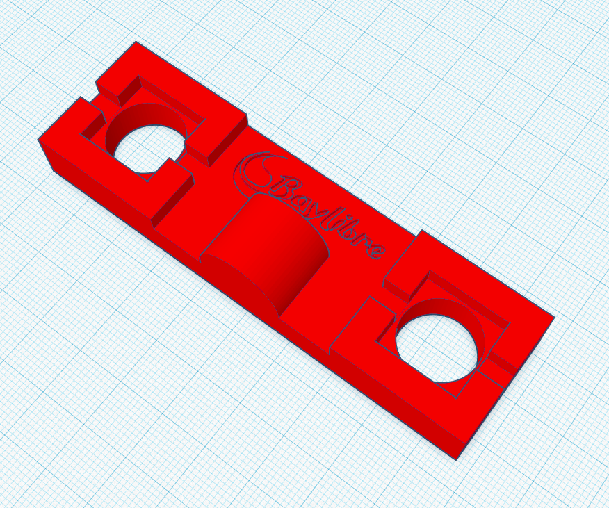
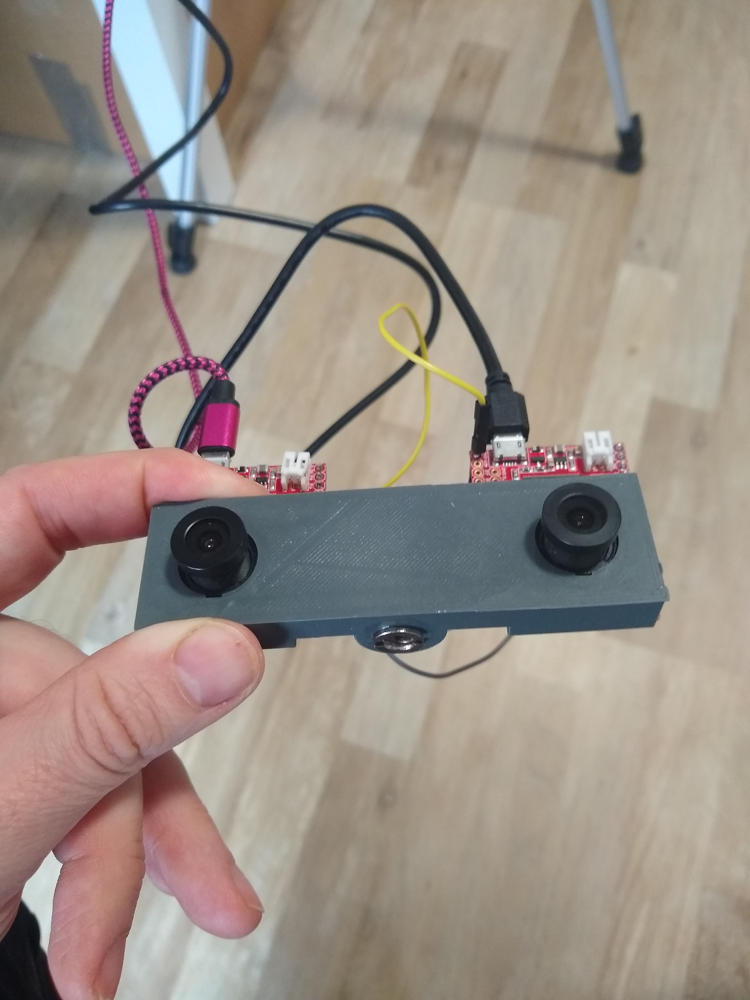
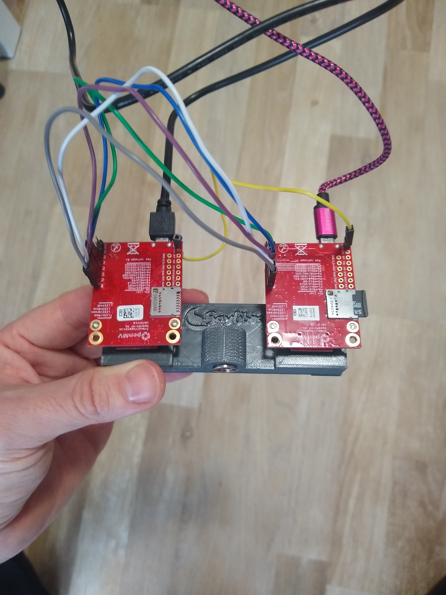
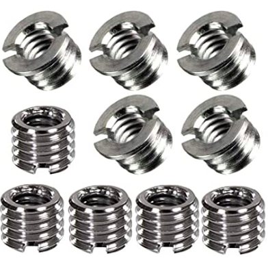
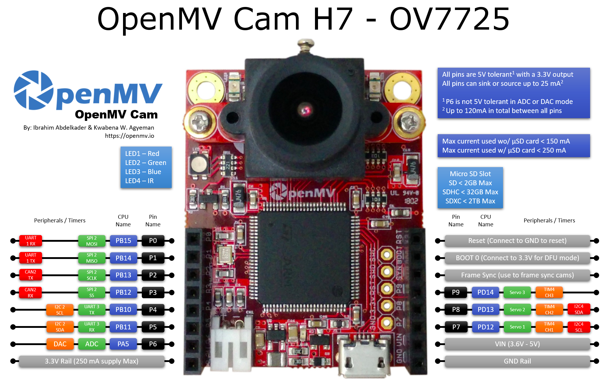
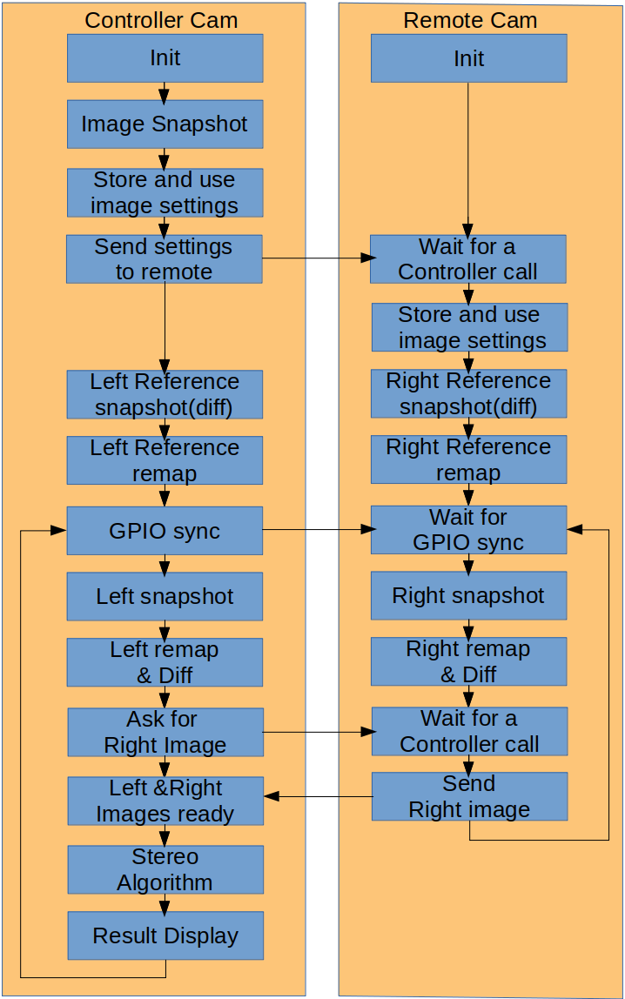

# OpenMV StereoVision Project

Stereo Vision Project based on 2 OpenMV H7 Cameras.

## Project structure

This project is a Stereovision POC based on 2 cameras using arm M7 cores.\
It is using several repos:

The current repo containing:
* The source code to be run on the cameras and on a desktop (prestudies or calibration)
* Images that are used as examples for the code running on a desktop
* Resources like the chessboard used to calibrate the cameras or 3d files

## Steps to run stereo on OpenMV H7

Several steps are needed before being able to run the stereo POC on the cameras.\
Here are the different steps to follow:


### Create the Stereo camera holder

The camera holder is a 3d printed piece of plastic that has been designed to hold tightly the camera themselves.





You can find the link to the STL file here [openmv_camera_holder.stl](resources/3d_files/openmv_camera_holder.stl)\
It is easy to change the distance between the 2 cameras if needed.

A screw is added at the bottom of the camera holder (after it has been drilled) so that it can be placed on a camera tripod.




The screw that is used is in fact a 1/4" to 3/8" adaptor. A bit of superglue may be needed in order to keep it in place.


Note that the cameras are upside down so that the cables do not prevent the holder to be fixed on a tripod.
The image are flipped back to normal by software.

Also note that the camera on the right when looking at the rear side of the system is the controller cam and is considered as the left cam in the code.
This is again because the cameras are upside down.


The constraints of the design were:
* As little vertical translation as possible between the 2 cameras.
* As little rotation as possible between the 2 cameras
* The 2 cameras pointing in the same direction (parallel and never converging)

As a consequence the cameras are hold by the camera module directly avoiding misalignments on the PCB.

### Connect the cameras

You must connect:
* P0, P1, P2 and P3 pin to pin in order to use SPI (0,1,2) and the RPC calls (3)
* P4 pin to pin in order to be able to synchronize the 2 camera sensors
* GND Rail pin to pin and/or have their USB plugged on USB slots with the same ground

You can check on the image below where the different pins are.


### Calibrate the cameras

Calibration is done in order to remove:
* The vertical translation betweem the 2 cameras
* The rotations  betweem the 2 cameras
* The lens abberations of each camera

In order to know which transformation to apply to each camera, a series of left and right pictures of must taken using a [chessboard](resources/chessboards/Checkerboard-A4-25mm-10x7.pdf).

Here are the steps to update the remote cam:
* Open the camera mounted folder
* Replace the contents of the local main.py by the contents of our python file
* By default the python file that is used is: [get_calibration_images_remote_side.py](src/target_code/get_calibration_images_remote_side.py)
* Unmount and unplug the camera

Run the process
* Create a temp folder on a microSD card that will be inserted on the controller camera
* Plug the controller camera
* Connect the camera to the IDE
* Select the controller python file [get_calibration_images_controller_side.py](src/target_code/get_calibration_images_controller_side.py)
* Plug the remote camera and wait for 2 blue flashes meaning that the camera is ready
* Start/run the script on the controller cam using the IDE
* Get as many pictures as you can with the chessboard in many different angles but always in full in both the left and right images
* Stop the script
* Unmount/unplug the cameras (the pictures do not seem to be )
* Replug the controller camera and copy the pictures in a repository on your desktop

Note that the images are QVGA. This is okay in order calibrate our system managing either QVGA or QQVGA images.

Now you have a lot of pictures that can be used to understand what are the optical characteristics of the system.
On your desktop, use the python file [calibration_and_stereo.py](src/prestudies/calibration_and_stereo.py) in order to generate the left and right mapping arrays.

In another terminal, go to the folder containing calibration_and_stereo.py.
If you are using the chessboard present in the resources and saved your images in the directory ../../images/new_chessboard_QVGA/, 
you can use the following command:
```bash
python calibration_and_stereo.py -cp ../../images/new_chessboard_QVGA/ -cw 10 -ch 7 -pa True
```
This will generate 2 big mapping arrays and one interpolation array on stdout (the last array should not change 
unless you decided to upgrade to a better interpolation algorithm).

If it is too hard for you to copy the arrays as they are huge, simply redirect stdout to a file and remove the first traces.


Those 2 mappings arrays can be used to update the [remap.h]
 file in the firmware code.

This means that each time you will change your system's geometry, you will have to go throught these steps and then rebuild and reflash both cameras firmwares.

 
### Build the openmv firmware code

Back to firmware folder,\
the first time you build the firmware code, you will have to build the mpy-cross binary

```bash
cd micropython/mpy-cross
make
cd ../..
```

The next times, the only thing to do to build or rebuild the code is:

```bash
make
```

### Flash the firmware

The cameras can be flashed using the OpenMV IDE.
So for each camera:
* Plug the camera
* Connect the camera to the IDE
* Select the menu Tools/Run Bootloader (Load Firmware)
* Select the firmware.bin file that has just been compiled

### Update the python code on the remote camera

Unlike the controller cam that is going to be run using the OpenMV IDE and that doesn't need
to have its python code updated, the remote camera is going to run stand alone.\
As a consequence, the python code of has to be updated manually the first time it is used or each
time we want to change the code.

This can be done using the IDE or more easily by:
* Opening the camera mounted folder
* Replacing the contents of the local main.py by the contents of our python file
* By default the python file that is used is: [stereo_remote_cam_QQVGA.py](src/target_code/stereo_remote_cam_QQVGA.py)
* Unmounting and unplugging the camera


### Run the full stereovision algorithm

Here are the steps to run the stereovision algorithm.
In order to have the 2 cameras syncronized:
* Plug the controller camera
* Connect the camera to the IDE
* Select the controller python file [stereo_controller_cam_QQVGA.py](src/target_code/stereo_controller_cam_QQVGA.py)
* Plug the remote camera and wait for 2 blue flashes meaning that the camera is ready
* start/run the script on the controller cam using the IDE

On the IDE framebuffer display, you should see an upside down image for several seconds then a black screen.
During this time, nothing should change in the cameras' fields of view.
As soon as the back screen appears, you can do whatever you want in front of the cameras.

Please note that the cameras should not move and the light conditions should not change too much.


## System general flow

Here is the general flow of the system:



## Run prestudy algorithms on a desktop

The parts that are being studied are:
* The calibration of the cameras
* The opencv stereo algorithm
* The special difference function
* The custom stereo algorithm

[More information can be found here](src/prestudies/) in the source code itself

## Explanation of the target python code


[More information can be found here](src/target_code/) in the source code itself

## Explanation of the changes made in the OpenMV firmware

Here are the main files to look for:

[imlib.c]
 contains the imlib_remap function.
The remap function uses the arrays stored in [remap.h].
Note that in order to to fit the huge remap arrays in the firmware, several functions and libs that are unused in our POC 
have been removed: Tensorflow and apriltags have for example been removed from the firmware and it won't be possible to use them.

[mathop.c]
 contains the imlib_difference_special and imlib_stereo functions.

All the functions have their python interface defined in [py_image.c]
 and [qstrdefsomv.h]


The code is based on a v3.6.8 tag because, at the time of the development, the SPI remote RPC in the master branch
 was not working at all. On top of this version, several changes regarding RGB have been cherry-picked from master.

### The Remap function

Simplified pseudo code:
```
for each corrected pixel with coordinates (i,j) in the corrected image
    Get the x and y values from the remap_array at the index (i,j)
    Set the value of the corrected_pixel with coordinates(i,j) to the value of the uncorrected_pixel with coordinates (i+x,j+y)
```
In the remap function, the values x and y from the remap array are actually not integers.
They are 2x 16bits signed where 12 bits are the integer part and 4 bits are the decimal parts.
As a consequence, you may need to get the pixel value of something that is not exactly located on a pixel on the source image.
A basic 2D interpolation is then used to get the pixel value from the 4 nearest pixels.


Rough estimate of this function complexity: A x width x height\
where A is the time to get the value in the remap array and interpolate the pixel value (getting 4 pixels values, 4 multiplications, 4 additions x 3 color channels)


### The Diff function

Simplified pseudo code:

First the comparison part used to decide if the pixel of the current image is different than the one in the ref image:

```
for each pixel with coordinates (i,j) in the current image and in the reference image
    Compare the value difference for each color channel to a threshold
    Compare the sum of the differences to another threshold
    if the diff is greater than the threshold
        Set the mask value with coordinates (i,j) to 1
    else
        Set the mask value with coordinates (i,j) to 0
```

Then the processing part used to remove the small blobs of zeros or ones in the mask:

```
for each value with coordinates (i,j) in the mask
    if the value has not been checked
        Find the neighbours with the same value and set them as checked
        if the blob size is smaller than a threshold value
            the values of this blob are set to the opposite value
```

then the final part, modifying the current image with the computed difference
```
for each value with coordinates (i,j) in the mask
    if the value is 1
        keep the pixel with coordinates (i,j) in the current image to its original value
    else
        set the pixel with coordinates (i,j) in the current image to black
```

Rough estimate of this function complexity: (B + C + D) x width x height\
* where B is the time to compare 2 pixel values (x 3 color channels)
* where C is the time to check a mask value and possibly change it
* where D is the time to change a pixel value depending on a mask value


Note that each byte of the mask contains 8 values, 1 per bit. This is done to save memory.
A set of defines is used to manage this.

### The stereo function

Simplified pseudo code:

```
for each pixel p with coordinates (i,j) in the left image
   if the value with coordinates (i,j) in the mask is 1
       for each pixel rx from (0, j) to (i,j) in the right image
           compute the sum of weighted diffs between arrays of size NxM centenred on p and centered on rx
       select the pixel rx with the minimum score (best match)
```

Rough estimate of this function complexity: E x width x width x height
* Where E is the time to compute the sum of weighted diffs between arrays of size NxM

However this algorithm highly depends on the number of ones in the mask. If the mask has only 0s, no computation at all will be done.
Also the pixels on the left of the image take less time than the ones on the right as we test the right pic pixels with a y coordinate < the y coordinate of the current pixel.


### Other steps taking time

A few other steps have to be taken into consideration:
* The snapshot: exposure can take up to 20 ms + synchronisation which is 2% of the time at 1fps and 20% of the time 10 fps
* The remote picture transmission: at 20 MHz a QQVGA (160x120) RGB (16bits) image will take at least 15,4 ms. A QVGA image will take 4 times more so around 62ms
* To make sure the transmission is ready, a 25ms sleep is added on the controller side which means the total transmission step will take at least 25 + 15 = 40ms for a QQVGA.

If this 25ms sleep is an issue, there is probably a way to avoid it using a second GPIO pin to signify to the controller cam that the transmission is ready.


## Limitations and known issues

### Light conditions and flickering

As the reference image is taken only at the beginning, a change in the light conditions makes the diff function work less and less fine.
As a consequence, the stereo algorithm is poluted by pixels should not be tested and that may not even be present in the second stereo image.
Light flickering is also making the diff function work less fine.

### Camera movements

Again, as the reference image is taken only at the beginning, a change in the camera position is going to make the diff function not work at all


## Timings

Here are typical timings taken with show_timings = True on the controller cam code using a QQVGA image and default settings.

When nothing has changed compared to the ref image (no pixels processed by the stereo algo):

| Measure   | Total   | Snapshot | Remap   | Diff   | Remote transmission | stereo  |
| ---       |  ------ |----------|---      | ----   | ----------          | ----    |
| time (us) | 92623   | 21744    | 3280    | 10655  | 50709               | 6235    |
| percent   | 100%    | 23.476%  | 3.541%  | 11.5%  | 54.748%             |6.732%   |

In this case the frame rate is about 11 fps.


When half of the pixels have changed:

| Measure   | Total   | Snapshot | Remap   | Diff   | Remote transmission | stereo  |
| ---       |  ------ |----------|---      | ----   | ----------          | ----    |
| time (us) | 3764885 | 13575    | 3284    | 10943  | 47314               | 3689769 |
| percent   | 100%    | 0.361%   | 0.0872% | 0.291% | 1.257%              |98.79%   |

In this case the frame rate is about 0.3 fps.


When most of the pixels are different compared to the ref image:

| Measure   | Total   | Snapshot | Remap   | Diff   | Remote transmission | stereo  |
| ---       |  ------ |----------|---      | ----   | ----------          | ----    |
| time (us) | 6334269 | 17927    | 3272    | 10689  | 44742               | 6257639 |
| percent   | 100%    | 0.283%   | 0.0517% | 0.169% | 0.706%              |98.79%   |


In this case the frame rate is about 0.15 fps.


Conlusions:
* The remap and the diff functions are taking less time than the time taken by the snapshot or the remote picture transmission and are almost negligeable.
* As soon as pixels are changed and the stereo algorithm is used, it is taking most of the time
* The rough average time spent per pixel (using the default settings) is 325us so as soon as there is a 10x10 image to process it will take most of the time
